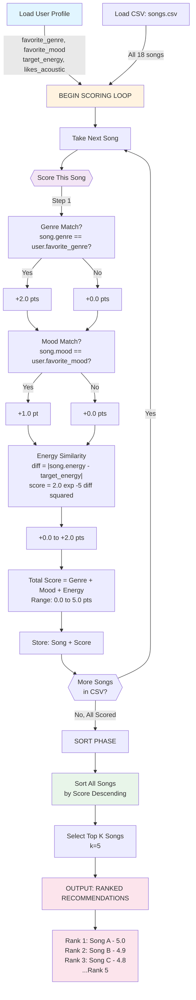

# 🎵 Music Recommender Simulation

## Project Summary

In this project you will build and explain a small music recommender system.

Your goal is to:

- Represent songs and a user "taste profile" as data
- Design a scoring rule that turns that data into recommendations
- Evaluate what your system gets right and wrong
- Reflect on how this mirrors real world AI recommenders

Replace this paragraph with your own summary of what your version does.

Combining content based scoring (genre, mood, energy preferences vs. song preferences), popularity signals, and diversity preserving ranking using Maximal Marginal Relevance. 

---

## How The System Works

### Data Flow: Input → Scoring Loop → Ranked Output



### Traditional Streaming Recommenders

Notes on how streaming platforms prediction systems work: 
- collabrative filtering: people with similar listening patterns to you help create taste profiles (either user to user or item to item similarity matrices)
- content based filtering: each song has features: tempo, acoustic-ness, key, and pitch. 
audio analysis tools extract these automatically. 
matches historical preferences (genres, moods, energy levels)
recent listens heavily weigh the model 
- contextual signs: time of day, activity, trends(new releases boosted), social (friends, region charts)
- relevance, diversity, discovery, engagement (listen through rate)

Deep learning: 
- transformer models learn from your skip and replay behavior and listening duration 
- neural netowrks predict listen probablilty 

Questions: 
- How do audio analysis tools extract these features? 


- Are there interesting ways of filtering music? (based on subject, words...)


- How often are the systems suggesting slighlty different arists/ moods? 
Spotify uses a concept called "exploration budget" -- a small percentage of recommendations are intentionally outside your profile to probe new territory. The rate is typically low (10-20%) and increases slightly when your listening behavior signals you're in a "discovery" mode (e.g., you've been skipping a lot). The system is essentially running a controlled experiment on you continuously.

- Does recent listens heavily weighing models keep user in a loop until they chooses to break out of it? How can that be trained to better reflect a user's propensitites?
Feedback loops can be counteracted with decay functions, mood detection, explicit/user controls, long-term v short-term taste models. 


Each `Song` has 10 attributes: 
For display: id, title, artist 

What is used for matching: 
- genre:  (pop, rock, alternative, jazz)
- mood:  vibe (happy, chill, intense)
- energy:  intensity 0 (calm) to 1 (intense)
- danceability: groove-ability (0-1)
- acousticness: electronic to organic (0-1)
- valence: sad to happy (0-1)
- tempo_bpm: not used directly because energy is more intuitive
- year/ era: decade-based 
- explicit: content filtering preference 
- language: filtering through language
- vocal presence: fully instrumental to heavy vocals (0-1)
- popularity: niche to mainstream 
- subgenre: within genres, smaller genres 

other possible ways of grouping songs: 
- Lyrics-based: NLP on lyrics to detect themes (heartbreak, rebellion, celebration), sentiment, even specific words or subjects
- Structural: song length, intro length, how long before the drop/chorus — useful for context (background music vs. active listening)
- Similarity to a seed song: "more like this one" using audio fingerprinting
- Instrumentation: drums-heavy vs. strings-heavy vs. synth-heavy
- Era/cultural moment: songs associated with specific cultural events or decades

`UserProfile` stores: 
- favorite_genre 
- favorite_mood 
- target_energy - 0-1 energy scale 
- likes_acoustic - whether they prefer organic instruments (T/F)

`UserProfile Questions` 
What about when someone just starts their account? (Ask them to choose their preferences)
- Explicit onboarding — ask them to pick 3-5 genres, a few artists, or rate some seed songs. This is the simplest and most common.
- Demographic defaults — age, region, language can seed a starting profile
- Popularity fallback — surface broadly popular songs until you have signal
- Transfer from other platforms — "import your Spotify taste"


Is favorite_genre, favorite_mood always consistent for UserProfile?  
- Maintaining multiple taste profiles per user (workout, focus, commute, relax)
- Weighting recent behavior more heavily to track shifting moods
- Inferring context (time of day, connected device, activity) to select which profile to apply

`Recommender` formula works: 
For every song the recommender asks, "How well does this ong match what this user wants?" 
Calculate a score from 0 to 100 by combiining: 

Genre Match - 30% weight 
genre exactly matches = 100 point 
related but different = 50 point 
completely different = 0 point 

Mood Match - 30% weight 
same as genre but with mood

Energy Match - 20% weight 

Valence Match - 10%
Acousticness - 5%
Danceability - 5%
Score = (0.30 × Genre Match) + (0.30 × Mood Match) + (0.20 × Energy Similarity) + (0.10 x Valence/Tone) + (0.05 x Acousticness) + (0.05 x Danceability)

All songs are sorted by score with the highest first. 
Diveristy Ranking: If the top songs are too similar, re-rank slighlty to add variety. 

`Relatedness map`: 

(Current manual grouping)
Electronic family:  synthwave, electronic, deep house, lofi, ambient
Rock family:        rock, metal, indie rock, alternative
Acoustic family:    folk, country, classical, jazz, soul
Pop family:         pop, indie pop, hip-hop, reggae

High energy:   intense, energetic, aggressive, confident
Low energy:    chill, peaceful, relaxed, dreamy, atmospheric
Positive:      happy, laid-back, nostalgic
Dark/complex:  melancholic, moody, focused

## (Come back to this with attribute based/ similarity matrix )

# Music Recommender Scoring Logic Design

## Overview
The scoring system ranks songs based on how well they match a user's preferences. This document outlines a point-weighting strategy that balances **categorical matches** (genre, mood) with **continuous metric alignment** (energy, valence, acousticness).

---

## Scoring Architecture

### Point Distribution (100-point scale)

| Factor | Points | Weight | Rationale |
|--------|--------|--------|-----------|
| **Genre Match** | 30 pts | 30% | Primary categorization; fundamental to music identity |
| **Mood Match** | 30 pts | 30% | Emotional alignment; core user expectation |
| **Energy Alignment** | 20 pts | 20% | Intensity/activity level matching; affects experience context |
| **Valence Alignment** | 10 pts | 10% | Musical positivity/tone; reinforces mood |
| **Acousticness** | 5 pts | 5% | User preference bonus (if they like acoustic music) |
| **Danceability** | 5 pts | 5% | Nice-to-have bonus factor |
| **TOTAL** | **100 pts** | **100%** | Normalized & easy to compare |

---

## Detailed Scoring Rules

### 1. **Genre Match** (30 points)
- **Exact match**: +30 pts
- **No match**: 0 pts
- **Logic**: Genre is a hard constraint; users typically search within genres to find songs with moods and themes they want 

### 2. **Mood Match** (30 points)
- **Exact mood match**: +30 pts
- **No match**: 0 pts
- **Logic**: Mood is equally important to genre; defines the emotional experience. This allows specificity to what they're looking for 

### 3. **Energy Alignment** (20 points)
- **Perfect alignment** (|user.target_energy - song.energy| ≤ 0.1): +20 pts
- **Good alignment** (difference ≤ 0.2): +15 pts
- **Fair alignment** (difference ≤ 0.3): +10 pts
- **Poor alignment** (difference > 0.3): 0 pts
- **Logic**: Continuous metric; small deviations acceptable but large gaps bad

### 4. **Valence Alignment** (10 points)
- Uses energy formula but with lower thresholds:
- **Perfect**: ±0.15 difference = +10 pts
- **Good**: ±0.25 difference = +7 pts
- **Fair**: ±0.40 difference = +3 pts
- **Poor**: > ±0.40 = 0 pts
- **Logic**: Lighter reinforcement; musical tone matters but less than energy

### 5. **Acousticness Bonus** (5 points)
- **If user.likes_acoustic = True**:
  - Song acousticness ≥ 0.7: +5 pts
  - Song acousticness 0.4-0.7: +2 pts
  - Song acousticness < 0.4: 0 pts
- **If user.likes_acoustic = False**:
  - Song acousticness ≤ 0.3: +5 pts
  - Song acousticness 0.3-0.6: +2 pts
  - Song acousticness > 0.6: 0 pts
- **Logic**: Preference-based bonus; can make or break tie-breakers

### 6. **Danceability Bonus** (5 points)
- **High danceability** (≥ 0.75): +5 pts
- **Medium danceability** (0.55-0.75): +2 pts
- **Low danceability** (< 0.55): 0 pts
- **Logic**: Universal appeal bonus; active genres get a lift

---

## Weighting Philosophy

### Why 30-30 for Genre and Mood?
- **Equal weight** reflects that both are equally important discovery dimensions
- Users searching for "happy pop" expect both criteria met
- Avoids over-indexing on one dimension

### Why 20 for Energy?
- **Half the weight** of genre/mood because it's continuous (more flexibility)
- Still significant: "chill" playlists differ from "workout" playlists
- Allows minor deviations (±0.1-0.2) without penalty

### Why Lower weights for Valence, Acousticness, Danceability?
- **Refinement factors**: break ties between similarly-scored songs
- **Diversity**: prevent one metric from dominating recommendations
- **Robustness**: if data quality varies, secondary factors don't skew results

## Design Decisions & Trade-offs

| Decision | Reason | Trade-off |
|----------|--------|-----------|
| 30-30 Genre/Mood split | Equal importance | Could prioritize one for different use cases |
| Hard 0-points for mismatches | Clear filtering | Misses cross-genre discovery opportunities |
| Bands for continuous metrics | Gradual degradation | Could use Gaussian/smooth functions instead |
| Acousticness & Danceability as bonuses | Tie-breakers only | Could elevate if user indicates they matter |
| 5-pt caps on refinement factors | Prevent tie-breaking dominance | Limits nuance in edge cases |

---

## Future Enhancements

1. **User Preference Learning**: Track which songs users actually skip/favorite
2. **Popularity Decay**: Boost lesser-known recommendations
3. **Temporal Weighting**: Favor songs from preferred eras
4. **Artist Diversity**: Avoid recommending 5 songs by same artist
5. **Tempo as Factor**: Include `tempo_bpm` for workout/study context
6. **Dynamic Weighting**: Adjust weights based on user profile (e.g., energy-sensitive users get 25 pts for energy)

---

## Implementation Notes

- **Normalize scores to 0-100** for human readability
- **Sort descending** (highest score first)
- **Break ties** using: danceability > valence > acousticness > song.id
- **Explain recommendations** by showing top 2-3 scoring factors


---

## Getting Started

### Setup

1. Create a virtual environment (optional but recommended):

   ```bash
   python -m venv .venv
   source .venv/bin/activate      # Mac or Linux
   .venv\Scripts\activate         # Windows

2. Install dependencies

```bash
pip install -r requirements.txt
```

3. Run the app:

```bash
python -m src.main
```

### Running Tests

Run the starter tests with:

```bash
pytest
```

You can add more tests in `tests/test_recommender.py`.

---

## Experiments You Tried

Use this section to document the experiments you ran. For example:

- What happened when you changed the weight on genre from 2.0 to 0.5
- What happened when you added tempo or valence to the score
- How did your system behave for different types of users

---

## Limitations and Risks

Summarize some limitations of your recommender.

Examples:

- It only works on a tiny catalog
- It does not understand lyrics or language
- It might over favor one genre or mood

You will go deeper on this in your model card.

---

## Reflection

Read and complete `model_card.md`:

[**Model Card**](model_card.md)

Write 1 to 2 paragraphs here about what you learned:

- about how recommenders turn data into predictions
- about where bias or unfairness could show up in systems like this


---

## 7. `model_card_template.md`

Combines reflection and model card framing from the Module 3 guidance. :contentReference[oaicite:2]{index=2}  

```markdown
# 🎧 Model Card - Music Recommender Simulation

## 1. Model Name

Give your recommender a name, for example:

> VibeFinder 1.0

---

## 2. Intended Use

- What is this system trying to do
- Who is it for

Example:

> This model suggests 3 to 5 songs from a small catalog based on a user's preferred genre, mood, and energy level. It is for classroom exploration only, not for real users.

---

## 3. How It Works (Short Explanation)

Describe your scoring logic in plain language.

- What features of each song does it consider
- What information about the user does it use
- How does it turn those into a number

Try to avoid code in this section, treat it like an explanation to a non programmer.

---

## 4. Data

Describe your dataset.

- How many songs are in `data/songs.csv`
- Did you add or remove any songs
- What kinds of genres or moods are represented
- Whose taste does this data mostly reflect

---

## 5. Strengths

Where does your recommender work well

You can think about:
- Situations where the top results "felt right"
- Particular user profiles it served well
- Simplicity or transparency benefits

---

## 6. Limitations and Bias

Where does your recommender struggle

Some prompts:
- Does it ignore some genres or moods
- Does it treat all users as if they have the same taste shape
- Is it biased toward high energy or one genre by default
- How could this be unfair if used in a real product

---

## 7. Evaluation

How did you check your system

Examples:
- You tried multiple user profiles and wrote down whether the results matched your expectations
- You compared your simulation to what a real app like Spotify or YouTube tends to recommend
- You wrote tests for your scoring logic

You do not need a numeric metric, but if you used one, explain what it measures.

---

## 8. Future Work

If you had more time, how would you improve this recommender

Examples:

- Add support for multiple users and "group vibe" recommendations
- Balance diversity of songs instead of always picking the closest match
- Use more features, like tempo ranges or lyric themes

---

## 9. Personal Reflection

A few sentences about what you learned:

- What surprised you about how your system behaved
- How did building this change how you think about real music recommenders
- Where do you think human judgment still matters, even if the model seems "smart"


# Data Flow: Music Recommender System

## System Architecture

```
┌─────────────────────────────────────────────────────────────────┐
│                         INPUT: USER PROFILE                      │
├─────────────────────────────────────────────────────────────────┤
│                                                                   │
│  UserProfile {                                                    │
│    favorite_genre: str         (e.g., "pop")                     │
│    favorite_mood: str          (e.g., "happy")                   │
│    target_energy: float        (0.0–1.0, e.g., 0.8)              │
│    likes_acoustic: bool        (True/False)                       │
│  }                                                                │
│                                                                   │
└─────────────────────────────────────────────────────────────────┘
                              ↓
┌─────────────────────────────────────────────────────────────────┐
│               PROCESS: SCORING LOOP (FOR EACH SONG)              │
├─────────────────────────────────────────────────────────────────┤
│                                                                   │
│  For every song in data/songs.csv:                               │
│                                                                   │
│    Song {id, title, artist, genre, mood, energy, ...}            │
│         ↓                                                         │
│    1. Genre Match Score                                          │
│       if song.genre == user.favorite_genre: +2.0 pts             │
│       else: 0 pts                                                │
│         ↓                                                         │
│    2. Mood Match Score                                           │
│       if song.mood == user.favorite_mood: +1.0 pt                │
│       else: 0 pts                                                │
│         ↓                                                         │
│    3. Energy Similarity Score                                    │
│       diff = |song.energy - user.target_energy|                  │
│       score = 2.0 × exp(-5 × diff²)                              │
│       range: 0.0–2.0 pts                                         │
│         ↓                                                         │
│    4. Combine Scores                                             │
│       total_score = genre + mood + energy                        │
│       range: 0.0–5.0 pts                                         │
│         ↓                                                         │
│    5. Store (song, total_score) pair                             │
│                                                                   │
│  END FOR                                                          │
│                                                                   │
└─────────────────────────────────────────────────────────────────┘
                              ↓
┌─────────────────────────────────────────────────────────────────┐
│            OUTPUT: TOP K RECOMMENDATIONS (SORTED)                │
├─────────────────────────────────────────────────────────────────┤
│                                                                   │
│  1. Sort all (song, score) pairs by score descending             │
│  2. Select top K songs (e.g., K=5)                               │
│  3. Return ranked list:                                          │
│                                                                   │
│     Rank  │  Song Title          │  Artist        │  Score       │
│     ──────┼──────────────────────┼────────────────┼──────────    │
│      1    │  Sunrise City        │  Neon Echo     │  5.0 ⭐⭐    │
│      2    │  Rooftop Lights      │  Indigo Parade │  4.9         │
│      3    │  Gym Hero            │  Max Pulse     │  4.8         │
│      4    │  ...                 │  ...           │  ...         │
│      5    │  ...                 │  ...           │  ...         │
│                                                                   │
└─────────────────────────────────────────────────────────────────┘
```

---

## Concrete Example

### INPUT
```python
user = UserProfile(
    favorite_genre="pop",
    favorite_mood="happy",
    target_energy=0.8,
    likes_acoustic=False
)
```

### PROCESS: Score 3 Sample Songs

**Song 1: Sunrise City (id=1)**
- Genre: "pop" → Matches user "pop" → +2.0 ✓
- Mood: "happy" → Matches user "happy" → +1.0 ✓
- Energy: 0.82 vs user 0.8 → diff=0.02 → exp(-5×0.0004) ≈ +1.998 ✓
- **Total: 5.0 / 5.0** 🎯

**Song 2: Storm Runner (id=3)**
- Genre: "rock" → No match "pop" → 0 ✗
- Mood: "intense" → No match "happy" → 0 ✗
- Energy: 0.91 vs user 0.8 → diff=0.11 → exp(-5×0.0121) ≈ +1.94
- **Total: 1.94 / 5.0** ❌

**Song 3: Coffee Shop Stories (id=7)**
- Genre: "jazz" → No match "pop" → 0 ✗
- Mood: "relaxed" → No match "happy" → 0 ✗
- Energy: 0.37 vs user 0.8 → diff=0.43 → exp(-5×0.1849) ≈ +0.41
- **Total: 0.41 / 5.0** ❌❌

### OUTPUT (k=5)
```
Rank 1: Sunrise City (5.0)       ← Perfect match
Rank 2: Rooftop Lights (4.9)     ← Excellent match
Rank 3: Gym Hero (4.8)           ← Very good match
Rank 4: ...
Rank 5: ...
```

---

## Data Structure Pseudocode

```python
# INPUT
user_profile = {
    'favorite_genre': 'pop',
    'favorite_mood': 'happy', 
    'target_energy': 0.8,
    'likes_acoustic': False
}

# PROCESS
songs_with_scores = []

for song in load_songs('data/songs.csv'):
    genre_score = 2.0 if song['genre'] == user_profile['favorite_genre'] else 0.0
    mood_score = 1.0 if song['mood'] == user_profile['favorite_mood'] else 0.0
    energy_diff = abs(song['energy'] - user_profile['target_energy'])
    energy_score = 2.0 * exp(-5 * energy_diff**2)
    
    total_score = genre_score + mood_score + energy_score
    songs_with_scores.append({
        'song': song,
        'score': total_score
    })

# Sort and pick top K
recommendations = sorted(songs_with_scores, key=lambda x: x['score'], reverse=True)[:5]

# OUTPUT
for rank, rec in enumerate(recommendations, 1):
    print(f"{rank}. {rec['song']['title']} ({rec['score']:.2f})")
```

---

## Key Insights

| Stage | What Happens | Example |
|-------|--------------|---------|
| **INPUT** | User tells system what they like | "I like pop, happy, energetic music" |
| **PROCESS** | System judges EVERY song against user preferences | "Does song X match these tastes? Score it." |
| **LOOP** | Repeat for all 18 songs in CSV | Compare pop vs rock, happy vs intense, 0.8 energy vs 0.3 energy |
| **SORT** | Rank all scored songs | [5.0, 4.9, 4.8, ...] |
| **OUTPUT** | Return top K recommendations | "Here are your top 5 songs" |

---

## Potential Biases & Limitations

| Bias | What Happens | Example | Impact |
|------|--------------|---------|--------|
| **Genre Lock-in** | Binary genre match (0 or 2.0) creates a hard barrier. Songs outside user's favorite genre get 0 points, even if perfect mood/energy match. | A jazz lover who prefers "chill" mood gets no jazz recommendations if their favorite_genre is "pop"; instead they get mediocre pop songs. | Users miss discovery opportunities; stuck in genre silos. |
| **Mood Over-indexing** | Mood is weighted equally to genre (1.0 pt), but mood categories are arbitrary and subjective. | Two songs tagged "happy" might feel completely different emotionally; system treats them identically. | If mood labels are inconsistent in the data, recommendations become unreliable. |
| **Energy Gaussian Cliff** | Energy similarity uses exp(-5×diff²), which has a sharp drop-off beyond ±0.3 difference. Songs slightly outside target energy are heavily penalized. | User wants 0.8 energy, but a perfect 0.5 energy song only scores ~0.1 pts despite being great for focus time. | Perfect songs for different moods/contexts are filtered out. |
| **No Popularity/Novelty** | Algorithm doesn't consider song popularity, artist diversity, or discovery. Always returns the "safest" matches. | Same 5 songs appear in recommendations every time user logs in with identical preferences. | Repetitive, boring recommendations; stale playlist. |
| **Acoustic Preference Unused** | `likes_acoustic` field in UserProfile is not factored into scoring. | A user who loves acoustic music gets no bonus for acoustic songs; acoustic-heavy songs never break into top 5. | User preference data is collected but ignored. |
| **Cold Start Problem** | New users must manually set favorite_genre, favorite_mood, target_energy. No behavioral history to infer preferences. | Brand new user picks "pop + happy + 0.5 energy" on day 1, but these might not reflect their true taste. | First recommendations are likely to be wrong. |
| **Catalog Size Bias** | With only 18 songs, genre distribution matters heavily. If most songs are "pop," pop lovers are over-served. | Dataset likely has imbalanced genre distribution (more pop/lofi than metal/classical). | Recommendations reflect catalog bias, not true user preference. |

# AI Music Recommender System

## Original Project

This project evolved from my Module 3 music recommender simulation. The original version explored how AI could suggest music based on user preferences such as mood, genre, or listening context. It functioned mainly as a basic recommendation prototype rather than a full applied AI system.

## Project Summary

This upgraded system is a context-aware AI music recommender. A user enters a listening request, such as a mood, activity, or genre preference, and the system retrieves relevant songs from a local music dataset before generating recommendations. The goal is to make recommendations more grounded, explainable, and testable.

## AI Feature: Retrieval-Augmented Generation

The system uses a retrieval step before generating recommendations. Instead of inventing suggestions from nowhere, it searches a local song dataset for tracks that match the user’s request. The recommendation generator then uses those retrieved songs as context when producing its final answer.

## Architecture Overview

The system follows this flow:

User input → guardrails → retriever → song dataset → recommendation generator → confidence scoring → output + logs.

The `/assets` folder contains the architecture diagram.

## Setup Instructions

1. Clone the repo:

```bash
git clone https://github.com/aayushalayla/music-recommender-project.git
cd music-recommender-project